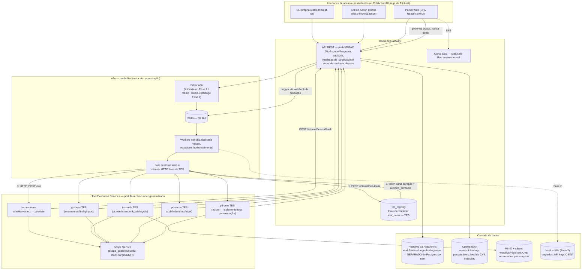

# Merovíngio — Clone Local da Trickest: Arquitetura Consolidada & Roadmap

**Documento gerado por**: análise multi-equipe (Arquitetura, Ferramentas & Segurança, Backend, UI/Frontend, DevOps/Infra, Dados) sobre a organização GitHub da [Trickest](https://github.com/orgs/trickest/repositories), com o objetivo de desenhar uma plataforma local e self-hosted equivalente — batizada de **Merovíngio**.
**Data**: 2026-08-05

> **Escopo de uso (decisão do dono do projeto, 2026-08-05)**: ferramenta interna para a equipe de **purple team**, servida em `localhost`, sem exposição a terceiros nem plano de SaaS — a ressalva sobre a Sustainable Use License do n8n (seção 3) não se aplica enquanto isso não mudar. Segredos ficam em `.env`/secrets de compose por decisão explícita; graduação para Vault fica em espera até haver gatilho concreto (seção 7).

> **Status de execução (atualizado em 2026-08-05)**: a fatia "Fundação crítica" da Fase MVP (seção 9) está implementada — ver [`backend-gateway/`](backend-gateway/): evolução do `scope_guard`, schema Postgres completo, auth JWT, CRUD de Workspace/Program/Target com RBAC e audit log, mais o fluxo completo de disparo de workflow / lease de TES / callbacks / reconciliação de Run (42 testes passando contra Postgres real). **A PoC vertical (item #3 de "Próximos Passos Imediatos" abaixo) também foi executada e validada de ponta a ponta contra a stack real**: n8n em modo fila + `backend-gateway` + o `recon-runner` já existente (não modificado) rodando dentro de um docker-compose funcional, disparando um scan real de theHarvester contra `hackthissite.org` e persistindo 83 subdomínios descobertos como `Asset`, com o `Run` reconciliado para `success`. Detalhes, incluindo dois problemas reais que a PoC revelou (e já corrigidos), em [`README.md`](README.md). Ainda não iniciado: TES adicionais além do recon-runner, Frontend, pipelines de Dados, Vault, Kubernetes — Fase v1/v2.

---

## Sumário Executivo

A Trickest é uma plataforma comercial de automação de segurança ofensiva (recon/ASM/bug bounty) construída sobre três pilares: (1) dezenas de ferramentas CLI atômicas em Go, majoritariamente MIT, compostas em pipelines; (2) dados abertos versionados (wordlists, resolvers, CVEs); (3) um motor de orquestração proprietário que encadeia essas ferramentas visualmente.

Este documento consolida a análise de seis equipes sobre como construir o equivalente local. A decisão mais importante — e bloqueante para todo o resto — foi fechada pela equipe de Arquitetura: **n8n em modo fila** como motor de orquestração, com um padrão de **"Tool Execution Service" (TES)** para isolar a execução de ferramentas ofensivas do próprio orquestrador. Esse padrão não é teórico: ele generaliza um serviço que **já existe e já roda neste repositório** — `Pentesters-Team/services/recon-runner/`, um wrapper FastAPI para o theHarvester com enforcement de escopo, controle de concorrência/timeout e normalização de saída. Todas as seis equipes ancoraram suas análises nesse serviço real em vez de desenhar no vácuo, o que resultou em recomendações incomumente concretas e mutuamente consistentes (ver seção 10 para os pontos onde a convergência — ou divergência — entre equipes foi verificada explicitamente).

**Regra de custódia central, repetida por todas as equipes**: o n8n nunca deve conter ou executar binários ofensivos diretamente (sem nó "Execute Command", sem nó Docker genérico para ferramentas de recon). Toda ferramenta roda atrás de um TES, chamado por HTTP a partir de nós customizados finos do n8n. Essa regra já existe no código hoje (`S3R4PH-Core/mcp_servers/core_mcp.py` documenta "custódia exclusiva de ferramentas ofensivas" pelo Pentesters-Team) — a arquitetura proposta apenas a estende para o novo orquestrador.

---

## 1. Diagrama Consolidado da Arquitetura



**Mapeamento de capacidades Trickest → stack local** (detalhado na seção de Arquitetura):

| Capacidade Trickest | Equivalente nativo escolhido | Desenvolvimento próprio necessário |
|---|---|---|
| Canvas visual de nós/arestas | Editor n8n (nativo) | Nós customizados por família de ferramenta |
| Agendamento de workflows | Cron/Schedule Trigger do n8n (nativo) | — |
| `trickest-cli` | API REST do Gateway | CLI própria |
| `trickest/action` | Webhook node do n8n (nativo) | Action própria + Gateway |
| Execução paralela em massa | Modo fila + workers horizontais (nativo) | Governança de concorrência (TES semaphore + fila dedicada) |
| Persistência de resultados ("Live Tables") | Nenhum nativo | Postgres + OpenSearch, alimentados pelos TES |
| Segredos/execução segura escalada (`vault-k8s`) | Credencial nativa do n8n é insuficiente | Vault + K8s (Fase 2), nunca o cofre nativo do n8n |
| Dados versionados (`wordlists`/`resolvers`/`cve`) | Nenhum | MinIO + `s5cmd`, sync agendado via n8n |
| UI paga de monitoramento | Editor n8n cobre só execução | Painel próprio (SPA) |

---

## 2. Modelo de Dados Central

Definido pela Arquitetura, refinado com schema de tabela pelo Backend:

- **Workspace** — organização/conta faturável.
- **Program** — um engajamento/programa de bug-bounty ou pentest dentro do Workspace. **É a fronteira real de isolamento multi-tenant** (não o Workspace) — `Target` e `Workflow habilitado` pertencem a um Program.
- **Target (escopo)** — extensão do `scope_guard` atual: domínios raiz, CIDRs, exclusões explícitas, por Program.
- **Workflow** — definição n8n versionada como JSON exportado em Git.
- **Run** — execução de um Workflow contra um Target. É a fonte de verdade de status (não o job efêmero).
- **ToolExecutionJob** — efêmero por design, exatamente como `jobs.py` já documenta hoje para o theHarvester ("recon-runner is not the source of truth for scan history").
- **Asset** — domínio/subdomínio/IP/URL/faixa-cloud/repo descoberto por um Run.
- **Finding** — generalização do `ReconReport` atual: severidade, evidência, status (novo/triado/falso-positivo/corrigido), CVEs referenciadas.

Schema relacional de referência (nível tabela — DDL completo é tarefa de implementação): `users`, `workspaces`, `workspace_memberships`, `programs`, `program_memberships`, `targets`, `workflow_definitions`, `program_workflow_enablement`, `runs`, `tool_execution_jobs`, `assets`, `findings`, `tes_registry`, `audit_log`. Ver seção C do Backend (abaixo) para os campos de cada tabela.

---

## 3. Arquitetura

### A. Análise

#### A.1 Decisão do motor de orquestração

Trickest não divulga o motor interno (é proprietário), mas o padrão observado nos repositórios públicos — workflows declarados como YAML de nós/arestas, `trickest-cli` para execução via terminal, `trickest/action` para CI/CD, execução "dry-run" antes de rodar de fato — é o de um motor de orquestração de pipelines com composição visual/declarativa de blocos, não um scheduler batch clássico. Isso restringe bastante o campo de candidatos "equivalentes": precisamos de algo que (1) deixe um analista de segurança montar uma cadeia `subfinder → dsieve → mksub → httpx → nuclei` sem escrever um DAG em Python, (2) rode comandos shell/contêineres nativamente, (3) escale para centenas de execuções concorrentes, e (4) aceite gatilhos externos (API/webhook) para paridade com o `trickest/action`.

Comparação, com licenciamento e maturidade verificados (agosto/2026), não apenas por conhecimento de treinamento:

| Motor | Licença (self-host) | Modelo de workflow | Shell/contêineres nativo | Concorrência/filas | Webhooks | Curva de aprendizado | Custo operacional | Extensibilidade |
|---|---|---|---|---|---|---|---|---|
| **n8n** | Sustainable Use License ("fair-code"): self-host **community é gratuito para uso interno**; a única restrição relevante é não revender o próprio n8n como serviço hospedado a terceiros. Partes `.ee.` são licença Enterprise (paga) | Canvas visual de nós/arestas — o mais próximo do padrão Trickest | Node "Execute Command" nativo (shell dentro do processo) + node HTTP Request para chamar serviços/contêineres externos | Modo fila (Redis + Bull) com workers horizontais escaláveis (`docker compose up --scale n8n-worker=N`) | Node Webhook nativo, API REST pública | Baixa para montar pipelines simples; média para modo fila/nós customizados (TypeScript) | Baixo para começar (SQLite single-instance); médio em modo fila (Postgres+Redis+workers) | Nós customizados em TS, comunidade grande, milhares de integrações prontas |
| **Temporal** | Servidor self-hosted **Apache 2.0**, gratuito e completo (mesmo código do Cloud) | 100% código — sem editor visual; workflows são funções Go/Java/Python/TS com replay determinístico | Não nativo — chamar contêineres/CLI é responsabilidade de "Activities" escritas por vocês | Execução durável e exactly-once muito forte; excelente para milhares de execuções longas | Sem webhook nativo — precisa de um serviço que receba o webhook e chame a Start Workflow API | Alta — determinismo, activities, task queues, signals/queries são conceitos novos até para devs experientes | Alto — 4+ serviços + Cassandra/MySQL/Postgres, idealmente + Elasticsearch para visibility | Altíssima, mas via SDK de código, não plugin |
| **Apache Airflow** | **Apache 2.0**, projeto maduro da ASF | DAGs **em código Python**, deploy via arquivo sincronizado na pasta de DAGs — UI é só para monitorar, não para criar/editar pipelines | `DockerOperator`/`KubernetesPodOperator` nativos e maduros, isolamento forte por pod | CeleryExecutor/KubernetesExecutor escalam bem, mas desenhado para orquestração **batch agendada**, não para trigger ad-hoc de alta frequência | Sem webhook "de fábrica"; existe a REST API `POST /dags/{id}/dagRuns` chamável por webhook externo | Alta para quem não é engenheiro de dados; exige deploy de código para qualquer mudança de pipeline | Alto — scheduler + webserver + triggerer + workers + banco | Providers oficiais extensos, mas voltados a ETL/dados, não a ferramentas ofensivas |
| **Windmill** | **AGPLv3** (copyleft forte) — self-host gratuito, mas AGPL exige disponibilizar o código-fonte a qualquer usuário que interaja com o serviço pela rede | Código-first (TS/Python/Go/Bash/SQL) com UI auto-gerada + editor de flow visual mais simples que o do n8n | Executa **Bash nativamente** como linguagem de primeira classe — encaixe natural com CLIs Unix | Workers Rust, desempenho muito bom, escala bem | Webhooks e triggers HTTP nativos | Média — ótimo para devs, menos amigável para analistas não-engenheiros montando pipelines visuais | Baixo/médio, core em Rust é leve | Boa, mas ecossistema de integrações prontas bem menor que o do n8n |
| **Prefect (v3)** | **Apache 2.0**, framework 100% open-source; self-host gratuito mas sem workspaces multi-tenant/SSO (só no Prefect Cloud) | Código Python (`@flow`/`@task`), sem canvas visual | Sem operator "shell" nativo pronto — chamar CLI é `subprocess` dentro de uma task Python | Boa para pipelines Python/ML; engine simplificada desde v3 | Suporta eventos/automations nativamente desde v3, mas não é webhook "GitHub-Action-style" pronto | Baixa para quem já é Python; não serve para usuários não-devs | Baixo/médio | Extensível via Python puro, mas pensado para pipelines de dados/ML |

**Por que não construir um motor do zero:** reimplementar scheduling, filas, retries/backoff, versionamento de pipeline, RBAC de execução e uma UI de acompanhamento é um projeto multi-ano por si só, replicando o que Airflow/Temporal/n8n já resolveram em produção com milhares de deployments. Além disso, um executor caseiro de comandos shell recebendo input de pipelines é, por si só, uma superfície de ataque nova que motores maduros já blindaram com anos de hardening.

**Recomendação: n8n, em modo fila (queue mode), como motor de orquestração central.**

Trade-offs conscientes:
- **Vs. Temporal**: abrimos mão de garantias de execução durável/exactly-once. Mitigação: manter Temporal como candidato de "fase 2" caso apareça necessidade concreta de execuções ultra-longas com garantias fortes — dívida arquitetural conhecida, não bloqueio do MVP.
- **Vs. Airflow**: abrimos mão do isolamento por pod nativo do `KubernetesPodOperator`. Ganhamos edição de pipeline self-service (sem deploy de código) — decisivo, porque quem monta cadeias de recon é o time de segurança, não engenheiros de dados.
- **Vs. Windmill**: concorrente tecnicamente mais forte (Bash nativo, core Rust leve). Desempate a favor do n8n: (1) UX de canvas mais madura para analistas não-devs; (2) a **AGPLv3** do Windmill é copyleft de rede — se a plataforma for exposta como serviço a clientes externos, a AGPL pode obrigar a publicar o código-fonte da integração completa. A Sustainable Use License do n8n só restringe revender o *próprio n8n* hospedado, não o produto construído por cima — risco jurídico menor.
- **Vs. Prefect**: sem canvas visual e sem multi-tenant/SSO no self-host — bom só como ferramenta interna auxiliar do time de Data (ex. pipeline nightly de indexação), não como motor central.

**Ressalva de conformidade**: antes de comprometer um roadmap comercial de SaaS, alguém precisa ler formalmente a Sustainable Use License do n8n — hoje o uso interno/self-host está livre de restrições relevantes, mas isso muda se o modelo de negócio migrar para revenda/hospedagem multi-tenant externa.

#### A.2 Arquitetura geral

**Decisão sobre onde as ferramentas de recon rodam**: nem (a) nós/plugins customizados executando o binário diretamente, nem (b) contêineres invocados soltos pelo workflow — e sim **(c) uma API dedicada de execução de ferramentas ("Tool Execution Service"), generalizando o padrão já implementado em `Pentesters-Team/services/recon-runner/`**, chamada pelo n8n via HTTP.

Isso não é uma escolha teórica — é a extensão direta de uma decisão já tomada e já em produção neste código. `recon-runner` já resolve, para theHarvester, exatamente os problemas que qualquer outro tool wrapper vai enfrentar:
- **Isolamento**: subprocesso via `asyncio.create_subprocess_exec` com argv em lista (nunca `shell=True`).
- **Controle de escopo centralizado**: `scope.py` importa `scope_guard` em vez de reimplementar a lógica de match de domínio.
- **Concorrência e timeout controlados**: `asyncio.Semaphore` + `asyncio.wait_for`.
- **Contrato tipado**: Pydantic (`RunRequest`, `ReconResult`, `JobStatusResponse`), saída normalizada.
- **Estado efêmero por design**: o job em memória não é a fonte de verdade — antecipa exatamente o modelo de dados proposto (Postgres/OpenSearch como fonte de verdade).

O `main.py` do recon-runner documenta a razão de existir dessa camada: preservar a regra de **"custódia exclusiva de ferramentas ofensivas"** (`S3R4PH-Core/mcp_servers/core_mcp.py`). Essa é a mesma regra que justifica rejeitar as opções (a) e (b): permitir que o n8n execute binários ofensivos diretamente quebraria esse princípio e ampliaria a superfície de ataque do próprio orquestrador. **n8n nunca deve ter os binários ofensivos instalados na sua imagem; ele só fala HTTP com os Tool Execution Services.**

Generalização: em vez de recriar um microsserviço do zero para cada CLI, extraímos o esqueleto do recon-runner num **framework reutilizável de TES**, onde cada ferramenta implementa só o equivalente a `harvester_runner.py` (um "adapter"). Ferramentas com stacks muito diferentes ganham serviços separados; ferramentas afins (dsieve+mksub+mkpath+mgwls, todas Go, texto-in/texto-out) compartilham um único serviço com múltiplos adapters.

Os "nós customizados" do n8n são **clientes HTTP finos** dos TES — nunca lógica de execução embutida no runtime do n8n. Para jobs longos, **callback (webhook) do TES de volta para o n8n** em vez de polling em loop.

#### A.3 Modelo de dados

Ver seção 2 deste documento consolidado.

### B. Plano de Implementação

| # | Tarefa | Descrição | Dependências | Esforço (S/M/L) | Responsável sugerido |
|---|---|---|---|---|---|
| 1 | PoC do motor | Validar a decisão n8n com um workflow real end-to-end antes de comprometer o roadmap | — | S | Arquitetura + DevOps/Infra |
| 2 | Provisionar n8n em modo fila | Deploy de n8n main + workers + Postgres + Redis | 1 | M | DevOps/Infra |
| 3 | Extrair framework "Tool Execution Service" | Generalizar `recon-runner` num template reutilizável com padrão de adapter por ferramenta | — | M | Backend + Tools/Security |
| 4 | Modelo de Target/Scope estendido | Ampliar `scope_guard` para CIDRs e múltiplos programas | 3 | S | Backend |
| 5 | Adapters para ferramentas Trickest | Empacotar dsieve/mksub/mkpath/mgwls/enumerepo/find-gh-poc como adapters | 3 | L | Tools/Security |
| 6 | Nós customizados n8n | Nós TS finos que chamam TES via HTTP, nunca executam ferramenta localmente | 2, 3 | M | Backend/Frontend |
| 7 | Backend Gateway | API que medeia CLI/Action/UI → n8n | 2 | L | Backend |
| 8 | CLI própria | CLI estilo `trickest-cli` sobre o Gateway | 7 | M | Backend |
| 9 | GitHub Action própria | Action estilo `trickest/action`, exit code por findings críticos | 7 | S | DevOps/Infra |
| 10 | Schemas de dados | Postgres (workflow/run/target/finding) + índices OpenSearch | 4 | M | Data |
| 11 | Serviço indexador | Generaliza `elasticsearch_index`, normaliza saída dos TES para o índice de busca | 3, 10 | M | Data |
| 12 | Integração Vault + K8s | Segredos/API keys via Vault, nunca no cofre nativo do n8n | 2 | M | DevOps/Infra |
| 13 | Camada de dados versionados | MinIO + `s5cmd`, sincronizados por workflow n8n agendado | 2 | M | Data + DevOps/Infra |
| 14 | Painel Web | Dashboard de assets/findings/execuções | 7, 10 | L | Frontend/UI |
| 15 | Governança de concorrência | Fan-out limitado, semáforo por TES | 2, 5 | M | DevOps/Infra |
| 16 | Auditoria da fronteira de custódia | Confirmar que nenhum node n8n executa binário ofensivo diretamente | 6 | S | Arquitetura + Security |

### C. Recomendações técnicas

- Subir o n8n **já em modo fila**, mesmo em baixo volume — evita migração dolorosa depois.
- **Nunca** expor o editor/API do n8n diretamente à internet — todo acesso externo passa pelo Backend Gateway.
- Proibir por design o node "Execute Command" e Docker genérico nos workflows n8n para ferramentas ofensivas.
- Preferir **callback via webhook** dos TES para o n8n em vez de polling.
- Manter o Postgres de metadados da plataforma **separado** do Postgres interno do n8n.
- Avaliar **OpenSearch** em vez de Elasticsearch puro dado o histórico de mudança de licença da Elastic (SSPL/Elastic License v2) — **nota do coordenador**: Backend e DevOps já convergiram independentemente para OpenSearch em seus exemplos concretos; tratamos isso como decisão de facto no restante do documento (ver seção 10).
- Antes de qualquer plano de SaaS a terceiros, ler formalmente a Sustainable Use License do n8n.
- Tratar Temporal como opção de segunda fase, não bloqueio do MVP.
- Versionar workflows do n8n como JSON exportado em Git.
- Todo TES novo é obrigado a chamar `scope_guard` (ou seu sucessor multi-Target) antes de qualquer subprocesso — sem exceção.

**Fontes consultadas**: [Sustainable Use License — n8n Docs](https://docs.n8n.io/sustainable-use-license/) · [n8n/LICENSE.md](https://github.com/n8n-io/n8n/blob/master/LICENSE.md) · [Queue mode — n8n Docs](https://docs.n8n.io/hosting/scaling/queue-mode/) · [Temporal self-hosted guide](https://docs.temporal.io/self-hosted-guide) · [KubernetesPodOperator — Airflow Docs](https://airflow.apache.org/docs/apache-airflow-providers-cncf-kubernetes/stable/operators.html) · [Windmill vs peers](https://www.windmill.dev/docs/compared_to/peers) · [Prefect v3 Docs](https://docs.prefect.io/v3/get-started) · [trickest/trickest-cli](https://github.com/trickest/trickest-cli) · [trickest/action](https://github.com/trickest/action)

---

## 4. Ferramentas & Segurança

### A. Análise

#### A.1 Ferramentas Go do Trickest — licença, estado real e decisão por ferramenta

Verificação feita via GitHub API (`license.spdx_id`, `pushed_at`, `archived`, issues abertas) e, para duas amostras (`dsieve`, `find-gh-poc`), leitura direta do arquivo `LICENSE` bruto — texto MIT padrão, `Copyright (c) 2022 Trickest`, sem cláusulas adicionais. Todos os 11 repositórios (6 Go + `resolvers`, `wordlists`, `cve`, `safe-harbour`, `inventory`) retornam `license.spdx_id: MIT`.

| Ferramenta | Licença | Última atualização | Estrelas / issues | Decisão | Justificativa |
|---|---|---|---|---|---|
| **dsieve** | MIT (verificado) | 2023-09-25 (parado) | 215 / 1 | **(2) Wrapper fino** — TES compartilhado | Filtro texto→texto, escopo fechado, sem superfície de ataque relevante |
| **mksub** | MIT | 2023-09-25 (parado) | 276 / 0 | **(2) Wrapper fino** — TES compartilhado | Gerador puro de combinações, não toca rede |
| **mkpath** | MIT | 2023-09-25 (parado) | 176 / 0 | **(2) Wrapper fino** — TES compartilhado | Mesmo raciocínio de mksub, para paths |
| **mgwls** | MIT | 2023-09-25 (parado) | 40 / 1 | **(2) Wrapper fino** — TES compartilhado | Utilitário trivial, sem dependências externas |
| **enumerepo** | MIT | 2023-09-25 (parado) | 78 / 0 | **(2) Wrapper fino**, atenção a credencial | API do GitHub é estável; risco real é como o token é injetado (Vault) |
| **find-gh-poc** | MIT (verificado) | **2025-08-01 (ativo)** | 163 / 1 | **(1) Usar diretamente** + papel elevado no pipeline de CVE | Único com atividade recente; já implementa back-off automático GraphQL |

Comparação com o ecossistema **ProjectDiscovery** (MIT confirmado, todos com push nos últimos dias — `subfinder` 14,1k★, `dnsx` 2,8k★, `httpx` 10,2k★, `nuclei` 30,3k★): a decisão **não é "substituir Trickest por ProjectDiscovery"** genericamente — são camadas diferentes do mesmo pipeline. `subfinder`+`dnsx`+`httpx`+`nuclei` entram como **motor pesado** de enumeração/probing/scanning; `dsieve`/`mksub`/`mkpath`/`mgwls` continuam como **utilitários auxiliares leves** que plugam entre estágios (`subfinder` → `dsieve` → `mksub` → `dnsx` → `httpx` → `nuclei`). `enumerepo`/`find-gh-poc` não têm equivalente no ecossistema PD (focado em rede/DNS/HTTP, não OSINT de GitHub) — permanecem como estão.

#### A.2 Contrato padrão de "Tool Adapter"

`Pentesters-Team/services/recon-runner/` já implementa, para theHarvester, o padrão que este contrato generaliza: `jobs.py` (semáforo + timeout, estado efêmero), `scope.py` (importa `scope_guard`, nunca reimplementa), `harvester_runner.py` (argv como lista, `_SAFE_DOMAIN_RE`, normalização de saída), `main.py` (auth por header, checagem de escopo antes de qualquer job).

Contrato generalizado, entregue como especificação ao Backend:

**Requisição** (`ToolRunRequest`): `{tool, run_id, target: {kind, value}, params, output_mode, timeout_s}` — `target` sempre validado contra o Scope Service antes de qualquer subprocesso; `params` passa por allowlist/regex por adapter, nunca interpolado em string de shell.

**Saída — JSON Lines para ferramentas de alto volume**: o padrão atual de `harvester_runner.py` (um JSON grande no final) é adequado só para saída limitada como theHarvester — **não escala** para `mksub` ou `subfinder`/`httpx` em alvos grandes. Recomenda-se uma linha JSON por item descoberto (`{"tool","run_id","type","value","meta","ts"}`), permitindo consumo incremental via callback por lote, mais um envelope final (`status`, `item_count`, `raw_ref` apontando para o stdout bruto arquivado no MinIO).

**Erros**: vocabulário fechado já usado por `main.py`/`jobs.py` — `domain_out_of_scope` (403), `invalid_domain`/`invalid_params` (422), `timeout`, `unauthorized` (401).

**Autenticação TES↔n8n**: hoje é token estático (`X-Internal-Token`), suficiente para o TES único atual. Ao multiplicar TES, migrar para mTLS ou tokens de curta duração emitidos pelo Vault.

#### A.3 Curadoria de wordlists e resolvers

Fontes confirmadas (MIT, todas com push no dia da pesquisa, confirmando workflow automatizado contínuo): `trickest/resolvers` (3 arquivos: simples/extended-com-metadados/trusted; validação por `dnsvalidator` paralelo + cross-reference WHOIS APNIC), `trickest/wordlists` (Technologies, Robots, Inventory Subdomains — 1,4M palavras, Cloud Subdomains — 940k palavras de +7M certificados TLS), **SecLists** (cobertura mais ampla: Discovery, Fuzzing, Passwords, Usernames — convenção de nomenclatura por tamanho já estabelecida, vale herdar).

Curadoria concreta: (1) **tiers por tamanho** (small/medium/large/xlarge, alinhado à convenção SecLists); (2) dedup/normalização (lowercase, strip, `sort -u` determinístico — Trickest e SecLists têm sobreposição significativa); (3) **frescor diferenciado**: resolvers sync diário (alta taxa de apodrecimento), wordlists sync semanal (mudam pouco); (4) versionamento via `s5cmd` em `s3://wordlists/<fonte>/<data>/` + ponteiro `latest`, mantendo últimas N versões; (5) metadado de proveniência por entrada.

#### A.4 Estratégia de feed de CVE

`trickest/cve` (MIT, o repo mais ativo do Trickest — push no dia da pesquisa) armazena Markdown por CVE, alimentado por dados oficiais + `find-gh-poc` + PoCs em vídeo do HackerOne + análise de referências. **Não replicar o modelo Markdown** — desenhado para publicação estática, não para pipeline com Postgres+OpenSearch já decididos.

Pipeline recomendado: **NVD API 2.0** (fonte primária estruturada — CVSS/CWE/CPE; 5 req/30s sem chave, 50 com chave grátis; poll incremental via `lastModStartDate`) + **GitHub Security Advisories** (advisories de ecossistema open-source, cobre gaps de supply-chain) + **OSV.dev** (camada de agregação/normalização, backstop quando NVD atrasa) + **`find-gh-poc` como TES próprio** para enriquecimento de PoC (reaproveita a mesma ferramenta que o `trickest/cve` usa internamente, com back-off automático já implementado). Documento canônico `CveRecord` normalizado das 4 fontes, com `source_provenance[]` — Postgres guarda o registro canônico (FK para Finding), OpenSearch indexa para busca.

#### A.5 Requisitos de segurança para execução em escala

**Isolamento**: manter subprocess-per-TES como padrão (adequado para ferramentas texto-in/texto-out sem parsing de conteúdo adversário: dsieve, mksub, mkpath, mgwls, enumerepo, find-gh-poc, subfinder, dnsx). Escalar para **container descartável por execução** quando: a ferramenta faz parsing profundo de conteúdo de rede não confiável, ou executa lógica de terceiros como parte normal do uso — **`nuclei` se enquadra aqui**: seus templates YAML da comunidade são essencialmente scripts de terceiros sendo executados, não apenas flags de CLI. Tratar execução de template do nuclei como execução de código não confiável.

**Rede sandboxed**: TES em namespace K8s dedicado com `NetworkPolicy` default-deny; egress só via proxy que registra destino+bytes por Run — segunda camada de defesa além do Scope Service (defesa contra pivô via redirect).

**Credenciais OSINT (Vault)**: nunca embutidas em imagem/env do TES, nunca no credential store nativo do n8n — mesma regra de custódia aplicada a binários. Vault Agent sidecar, auth via K8s ServiceAccount, TTL curto, path/role distinto por fonte (least privilege).

**Rate-limiting para não violar ToS**: crt.sh (sem limite formal, mas bloqueia IPs sob carga — máx. 2-3 req simultâneas), GitHub (5.000 req/h autenticado, 60/h sem auth), Shodan (cota por créditos, 100/mês no plano grátis), NVD (5 req/30s sem chave, 50 com chave). Recomenda-se **limitador central compartilhado** (token-bucket em Redis) em vez de limitador por réplica de TES.

### B. Plano de Implementação

| # | Tarefa | Descrição | Dependências | Esforço (S/M/L) | Responsável sugerido |
|---|---|---|---|---|---|
| 1 | Especificar o "Tool Adapter Contract" v1 | Schema de requisição/resposta, envelope JSONL, vocabulário de erros | — | M | Ferramentas & Segurança + Backend |
| 2 | Empacotar TES "text-utils" | dsieve+mksub+mkpath+mgwls num único TES | 1 | S | Ferramentas & Segurança |
| 3 | Empacotar TES "gh-osint" | enumerepo+find-gh-poc, token GitHub via Vault | 1, Vault K8s auth | M | Ferramentas & Segurança |
| 4 | Empacotar TES "pd-recon" | subfinder+dnsx+httpx como motor principal | 1 | M | Ferramentas & Segurança |
| 5 | Empacotar TES "pd-vuln" (nuclei) com isolamento por execução | Job K8s descartável por execução de template | 1, item 9 | L | Ferramentas & Segurança + Infra |
| 6 | Pipeline de sync wordlists/resolvers | Job agendado (`s5cmd`) puxando Trickest + SecLists para MinIO | Bucket MinIO | M | Ferramentas & Segurança + Data |
| 7 | Curadoria inicial (tiers/dedup/proveniência) | Normalização, dedup, tiers, metadado de origem | 6 | M | Ferramentas & Segurança |
| 8 | Pipeline de ingestão de CVE | NVD 2.0 + GHSA + OSV.dev + enriquecimento via find-gh-poc | 3, schema Postgres/ES (Data) | L | Ferramentas & Segurança + Data |
| 9 | Path de escalonamento para isolamento total | K8s Job descartável por run + runtimeClass gVisor/Kata | Cluster K8s | L | Infra + Ferramentas & Segurança |
| 10 | NetworkPolicy default-deny + proxy de egress | Namespace dedicado a TES, egress auditado por Target | Namespace TES | M | Infra + Ferramentas & Segurança |
| 11 | Integração Vault para chaves OSINT | Vault Agent sidecar, auth K8s ServiceAccount, path/role por fonte | Vault provisionado | M | Ferramentas & Segurança + Infra |
| 12 | Rate limiter central (Redis token-bucket) | Biblioteca compartilhada entre TES | Redis já no stack do n8n | S | Ferramentas & Segurança |
| 13 | Evoluir autenticação TES↔n8n | Migrar token estático para mTLS/JWT curto via Vault | 11 | M | Ferramentas & Segurança |
| 14 | Matriz de licenças + revisão trimestral | Registrar decisão por ferramenta, revisar `pushed_at`/CVEs a cada trimestre | — | S | Ferramentas & Segurança |

### C. Recomendações técnicas

1. Nenhuma das 6 ferramentas Go do Trickest precisa ser descartada por licença — decisão de substituir é sobre manutenção/sobreposição funcional, não risco jurídico.
2. `find-gh-poc` merece tratamento diferenciado: única com atividade recente, promovida a peça do pipeline de CVE.
3. ProjectDiscovery entra como motor principal, não substituto 1:1 dos utilitários Trickest.
4. Contrato de adapter migra para JSON Lines em ferramentas de alto volume.
5. `nuclei` é o único caso claro para isolamento total por execução no conjunto avaliado.
6. Toda chave de API OSINT é tão sensível quanto uma ferramenta ofensiva — Vault, nunca n8n.
7. Rate limiting centralizado (Redis), não replicado por adapter.

**Fontes**: repositórios `trickest/*` e `projectdiscovery/*` no GitHub · [NVD API Key Announcement](https://nvd.nist.gov/general/news/API-Key-Announcement) · [GitHub REST API rate limits](https://docs.github.com/en/rest/using-the-rest-api/rate-limits-for-the-rest-api) · [Shodan credit types](https://help.shodan.io/the-basics/credit-types-explained) · [SecLists](https://github.com/danielmiessler/SecLists)

---

## 5. Backend

### A. Análise

#### A.1 Escopo e prior art

O Gateway generaliza padrões já validados no `recon-runner`: `jobs.py` (`_JOBS` em memória, `_MAX_CONCURRENT_JOBS=3`, `_JOB_TIMEOUT_SECONDS=200`, comentário explícito "recon-runner is not the source of truth for scan history" — exatamente o `ToolExecutionJob` efêmero do modelo de dados); `scope.py` (importa `scope_guard` via `sys.path`, fonte única de verdade compartilhada com `pentest_mcp.py`); `main.py` (auth por header `X-Internal-Token`, lido a cada request, não cacheado — bom modelo mínimo de auth serviço-a-serviço, insuficiente sozinho para multi-tenant); `harvester_runner.py` (argv nunca via shell, normalização em `ReconResult`).

#### A.2 API do Backend Gateway

Duas famílias de rotas com superfícies de rede distintas: **públicas** (`/targets`, `/workflows`, `/runs`, `/findings`, `/assets`, `/programs`, `/users` — atrás de ingress+WAF, JWT de usuário) e **internas** (`/internal/*` — só alcançáveis dentro da malha de serviço, mTLS/rede privada, nunca no ingress público).

Ponto crítico verificado contra a documentação atual do n8n: **a API REST pública versionada do n8n (`X-N8N-API-KEY`) não tem endpoint documentado para "executar workflow X com payload Y"** — serve para CRUD de workflows e consulta de execuções. O único caminho suportado para disparar um workflow **com dados de entrada** é a **URL de produção de um nó Webhook** dentro do próprio workflow. Consequência de design: o Gateway trata isso como duas integrações distintas — (1) **Gestão** via API REST versionada (import/export, consulta), (2) **Disparo** via webhook de produção (`responseMode=immediately`) — `POST /workflows/{id}/run` no Gateway efetivamente chama esse webhook e responde 202 sem bloquear pela duração real do workflow.

Como o `n8n_execution_id` não vem garantido na resposta imediata do webhook, todo workflow-padrão tem como primeiro nó um `HTTP Request → POST /internal/execution-started {run_id, execution_id}`, permitindo ao Gateway casar o par assim que chega.

#### A.3 Registry de TES e normalização — decisão

**O Gateway é a fonte de verdade do registry TES; o workflow n8n só carrega um identificador lógico (`tool_name`), nunca um endereço físico.** Justificativa: (1) desacopla "onde um serviço está" de "o que o pentester desenhou" — redeploy/rotação de um TES não vira bump de versão de workflow; (2) controle de custódia adicional — `tool_name` só resolve para endereço físico através do Gateway, que valida escopo/autorização antes de emitir um lease, fechando a brecha de um nó customizado apontar para um serviço não registrado; (3) centraliza política de concorrência/timeout por ferramenta como dado, não código.

Mecânica: nó n8n → `POST /internal/tes-lease {tool_name, run_id, target_id, params}` → Gateway resolve `tool_name→base_url`, valida AuthZ+escopo, emite token de curta duração (Vault) → responde `{tes_base_url, internal_token, allowed_domains[]}` (subconjunto de escopo relevante, não o `scope.json` global) → nó chama o TES diretamente → TES roda seu próprio `scope_guard` local contra `allowed_domains` recebido (defesa em profundidade).

**Normalização continua no adapter de cada TES** (padrão `harvester_runner._map_result`), não numa camada central no Gateway — decisão explícita para evitar um monólito de parsers acoplado a toda mudança de qualquer tool. O Gateway só valida o envelope comum estruturalmente e faz upsert/republicação no OpenSearch.

#### A.4 AuthN/AuthZ multi-tenant

Três camadas: **Workspace** (conta faturável) → **Program** (engajamento — fronteira real de isolamento cross-tenant) → **Target/Workflow habilitado** pertencem ao Program. Usuário tem `workspace_membership` (owner/admin/billing) e `program_membership` (admin/operator/viewer) independentes; permissão efetiva = workspace_role alto OU membership explícita no Program. Todo query do Gateway carrega `program_id` e passa por middleware obrigatório de checagem.

O `scope.json` global atual (fallback hardcoded `["localhost","127.0.0.1"]`) não escala para multi-tenant — vira a tabela `targets` no Gateway. A **função** de verificação (`is_in_scope`, suffix-match) é portada 1:1, não reescrita.

#### A.5 Fluxo de callback e reconciliação

**Nível 1** (por ferramenta, `ToolExecutionJob` efêmero): TES conclui → `POST /internal/tes-callback` → Gateway persiste **e então** destrava a execução via nó **Wait em modo Webhook** do n8n (URL de retomada única por execução) — nunca polling com dezenas de nós Wait em paralelo.

**Nível 2** (fim do Run): último nó `POST /internal/n8n-callback`, complementado pelo recurso nativo de **"Error Workflow"** do n8n (Error Trigger disparado automaticamente em qualquer falha), garantindo que o Gateway sempre recebe um callback de nível-Run, feliz ou infeliz.

**Reconciliação**: ao receber `/internal/n8n-callback`, o Gateway consulta os `tool_execution_job`s daquele `run_id`. Sucesso reportado pelo n8n + jobs pendentes → `completed_with_warnings` (sinal de callback perdido). Erro do n8n não descarta resultados parciais já persistidos.

### B. Plano de Implementação

| # | Tarefa | Descrição | Dependências | Esforço (S/M/L) | Responsável sugerido |
|---|---|---|---|---|---|
| 1 | Esquema Postgres da plataforma | `users`, `workspaces`, `programs`, `*_memberships`, `targets`, `workflow_definitions`, `runs`, `tool_execution_jobs`, `assets`, `findings`, `tes_registry`, `audit_log`, separado do Postgres do n8n | — | M | Backend + Data |
| 2 | Módulo de escopo do Gateway | Portar `scope_guard.is_in_scope` para consulta contra `targets` por `program_id` | 1 | S | Backend |
| 3 | AuthN/AuthZ (JWT + RBAC workspace/program) | Login, middleware de membership obrigatório, matriz de permissões | 1 | M | Backend |
| 4 | CRUD de `targets`/`programs` | Endpoints com auditoria em `audit_log` a cada PATCH de escopo | 1-3 | S | Backend |
| 5 | Registro/versionamento de `workflows` | Import JSON do Git, publica via API de gestão n8n, grava `webhook_url` de produção | 1 | M | Backend + DevOps |
| 6 | Disparo de execução (`POST /workflows/{id}/run`) | Valida AuthZ+escopo, cria Run, dispara webhook de produção, 202 imediato | 2-5 | M | Backend |
| 7 | `tes_registry` + `/internal/tes-lease` | Registro TES + endpoint de lease com token de curta duração | 1, 2 | M | Backend + DevOps |
| 8 | `/internal/tes-callback` + upsert | Validação estrutural do envelope, persistência idempotente, publicação no OpenSearch | 1, 7 | M | Backend |
| 9 | `/internal/execution-started`/`n8n-callback` + reconciliação | Casamento run_id↔execution_id, lógica de reconciliação, Error Workflow | 6, 8 | L | Backend |
| 10 | Nó Wait/webhook-resume nos templates | Padronizar templates: execution-started → Wait-em-webhook por etapa → n8n-callback + Error Workflow | 5, 9 | M | Backend + time de templates n8n |
| 11 | API de leitura runs/findings/assets | Listagem/filtro paginado, busca full-text delegada ao OpenSearch | 1, 8 | M | Backend |
| 12 | Cancelamento de Run | `POST /runs/{id}/cancel` mapeando para stop via API de gestão n8n | 6, 9 | S | Backend |
| 13 | Adapter TES de referência (2º tool) | Validar padrão do envelope/lease com uma segunda ferramenta | 7, 8 | M | Pentesters-Team + Backend |

### C. Recomendações técnicas

**Envelope comum TES→Gateway** (generaliza `ReconResult`):
```python
class ToolExecutionEnvelope(BaseModel):
    tool_execution_job_id: str
    run_id: str
    target_id: str
    status: Literal["done", "error"]
    started_at: str
    finished_at: str
    assets: List[AssetInput] = []
    findings: List[FindingInput] = []
    raw_output: Dict[str, Any] = {}
    error: Optional[str] = None
```

Ver seção 2 deste documento para o schema relacional completo (tabelas nível-campo estão detalhadas na íntegra na resposta original do Backend, arquivadas junto a este consolidado).

**Pontos de atenção**: `/internal/*` fora do ingress público (mTLS ou rede privada + token por TES via Vault, nunca segredo estático compartilhado); validar se o endpoint de stop de execução do n8n está disponível na edição implantada (community vs. enterprise) antes de fechar `POST /runs/{id}/cancel`.

**Fontes**: [n8n Webhook node docs](https://docs.n8n.io/integrations/builtin/core-nodes/n8n-nodes-base.webhook/) · [Executing a workflow via API call — n8n Community](https://community.n8n.io/t/executing-a-workflow-via-api-call-without-webhook-or-cli-command/212895) · [n8n Workflows API reference](https://n8n-io-n8n.mintlify.app/api/workflows)

---

## 6. UI/Frontend

### A. Análise

#### A.1 O editor nativo do n8n é suficiente?

**Decisão: reaproveitar 100% do canvas do n8n para autoria do pipeline — não recriamos um construtor visual. Mas o editor não vira a superfície principal do produto**, e sua exposição muda entre Fase 1 e Fase 2.

Verificação na documentação atual do n8n: `N8N_EDITOR_BASE_URL` só define a URL externa de referência do editor, não habilita iframe nem resolve auth. Embedding via iframe é tecnicamente viável (CSP `frame-ancestors` via `N8N_SECURITY_POLICY_MANAGED_BY_ENV`), mas o SSO limpo depende do recurso **"OEM Integration / Token Exchange"** (RFC 8693), que: (1) exige **licença Enterprise**; (2) é rotulado **preview/experimental** pela própria documentação n8n; (3) o token emitido carrega o conjunto **completo** de permissões do usuário n8n subjacente — o n8n não restringe por `scope`/`resource` (só audita), então não serve para impor RBAC granular por Target/Program.

**Conclusão em duas fases**: **Fase 1 (MVP)** — editor **linkado**, não embutido, acessível só a uma persona restrita ("autor de workflow"), em rede interna, sem depender de recurso preview. **Fase 2 (opcional)** — iframe + Token Exchange, se a org tiver licença Enterprise e aceitar o status experimental. Em ambos os casos, a maioria dos analistas nunca abre o canvas do n8n — interagem 100% com um catálogo de workflows publicados/aprovados.

#### A.2 Telas mínimas

| Tela | Fonte de dados | Tempo real |
|---|---|---|
| Dashboard de Execuções | API REST do Gateway (tabela `runs`) | SSE (Server-Sent Events) — mais simples que WebSocket, reconexão nativa, atravessa proxies melhor |
| Launcher de Workflow | Catálogo de workflows publicados + Targets autorizados (RBAC) | Redireciona ao Dashboard via mesmo canal SSE |
| Achados/Findings | Gateway como **proxy de busca** sobre OpenSearch — nunca o browser falando direto com o ES (sem auth/RBAC próprio, DSL não confiável no cliente, risco de DoS por query cara) | Não crítico; polling 30-60s ou toast via SSE |
| Gestão de Wordlists/Resolvers | Gateway na frente do MinIO; upload via URL pré-assinada direto ao MinIO | Não |
| Gestão de Target/Escopo | 100% API REST do Gateway → Postgres | Não |

**Achado crítico de grounding**: `app/scope.py` hoje importa `scope_guard.py`, que carrega um **único arquivo JSON plano** (`scope.json`) com allow-list de domínios por suffix-match — sem múltiplos Targets, CIDR ou exclusões explícitas. **A tela de Target/Escopo não pode ser um CRUD cosmético em cima disso** — depende da evolução do modelo (Backend #2) para um Postgres multi-Target compartilhado por todos os TES. Bloqueio explícito, não silencioso.

#### A.3 Fluxo do analista

Login → confirma/cria Target (Alvos & Escopo) → escolhe workflow publicado + Target + parâmetros (Iniciar Execução) → acompanha via SSE (Dashboard) → pivota para Achados, filtra/triagem → (persona "autor de workflow", ocasional) ajusta pipeline no n8n externo → volta à UI para "publicar" a nova versão no catálogo — gate deliberado e auditável, evita que rascunhos não revisados virem lançáveis.

### B. Plano de Implementação

| # | Tarefa | Descrição | Dependências | Esforço (S/M/L) | Responsável sugerido |
|---|---|---|---|---|---|
| 1 | Shell da SPA e IA de navegação | Roteamento, guarda de auth, navegação RBAC-aware | Contrato de auth do Gateway | M | Frontend |
| 2 | Dashboard de Execuções | Lista de Runs + timeline por nó | `/runs` + canal SSE | L | Frontend + Backend |
| 3 | Canal SSE de status | Gateway faz polling interno de n8n/TES, republica via SSE filtrado por RBAC | — | M | Backend (consumido pelo Frontend) |
| 4 | Workflow Launcher + fluxo de "publicar workflow" | Formulário Target+parâmetros; tela de promoção n8n→catálogo | Endpoint de trigger + tabela de catálogo | L | Frontend + Backend |
| 5 | Achados — lista/filtros/facetas | Proxy de busca do Gateway sobre OpenSearch | Endpoint de busca com filtro de escopo | L | Frontend + Backend |
| 6 | Achados — painel de triagem | Status, notas, vínculo CVE/Asset/Run, auditoria | Endpoint de mutação de Finding | M | Frontend + Backend |
| 7 | Gestão de Target/Escopo (UI) | CRUD de programas/domínios/CIDRs/exclusões | **Bloqueante**: evolução do `scope_guard` (Backend #2) | M (bloqueada até dependência resolvida) | Frontend + Backend/Plataforma |
| 8 | Gestão de Wordlists/Resolvers | Versionamento, "fixar versão ativa", upload via URL pré-assinada | Endpoint de presign + registro pós-confirmação | M | Frontend + Infra/Backend |
| 9 | Integração de auth Gateway↔SPA | Login, RBAC, sessão, refresh silencioso | Contrato de auth do Gateway | M | Frontend + Backend |
| 10 | Acesso ao Editor de Workflows (Fase 1, link externo) | Link autenticado separado, visível só a "autor de workflow" | Provisionamento de usuário no n8n | S | Frontend + Infra |
| 11 | PoC iframe + Token Exchange (Fase 2, opcional) | Avaliar CSP + OEM Token Exchange | Licença Enterprise do n8n | L | Frontend + Infra |
| 12 | Sistema de design/componentes base | Badges de severidade, chips de status, empty states | — | S | Design + Frontend |

### C. Recomendações técnicas

- **Stack**: seguir o precedente já existente no monorepo (`Workspace/Trinity/frontend`) — React 18 + TypeScript + Vite + MUI + TanStack Query + React Router com rotas guardadas por RBAC.
- **Nunca falar direto com OpenSearch do browser** — proxy de busca no Gateway sempre.
- **SSE em vez de WebSocket** para push servidor→cliente; fallback de polling 3-5s para redes restritivas.
- **Uploads grandes via URL pré-assinada direto ao MinIO**, nunca streaming pelo Gateway.
- **Postgres como fonte de verdade transacional de Finding**; OpenSearch como índice de busca eventualmente consistente.
- **`scope_guard` precisa evoluir antes da tela de Target/Escopo ter valor real** — sem isso, fica cosmética e corre risco de divergir do que é de fato aplicado no servidor.

**Fontes**: [Set up token exchange — n8n Docs](https://docs.n8n.io/deploy/host-n8n/deploy-as-an-oem-integration/set-up-token-exchange) · [Configure SSO — n8n Docs](https://docs.n8n.io/deploy/host-n8n/configure-n8n/security/configure-sso) · [Is it possible to run n8n in iframe? — Community](https://community.n8n.io/t/is-it-possible-to-run-n8n-in-iframe/8980)

---

## 7. DevOps/Infra

### A. Análise

#### A.1 Convenções locais já em vigor

Mapeadas antes de propor qualquer coisa nova: `Pentesters-Team/docker-compose.yml` roda `recon-runner` em `recon_net` (rede nomeada, sem porta de host publicada, healthcheck, `restart: unless-stopped`); `Workspace/Trinity/docker-compose.yml` consome `recon_net` como `external: true` (nunca recria) — o padrão "gateway em múltiplas redes, serviço interno isolado numa rede só" que a plataforma nova replica; `services/recon-runner/Dockerfile` usa imagem base fixada por digest, usuário não-root, é o padrão de Dockerfile a seguir; `jobs.py` já implementa exatamente o padrão de concorrência (semáforo+timeout) descrito na arquitetura; `gateguard/interceptor.py` é hoje um hook interativo do Claude Code (aprovação via `/dev/tty`) — o **padrão** (allow/deny declarativo + log de auditoria) é reaproveitável, a implementação interativa não roda como está num TES/Gateway em produção.

**Achado relevante**: já existe um `TRICKEST_TOKEN` em uso no `.env` do Pentesters-Team — sinal de uma dependência viva do Trickest SaaS em algum ponto da automação atual. Não aprofundado aqui, mas indica que o corte para o clone local provavelmente exige um período de operação em paralelo e checklist de paridade antes de desligar esse token (ver seção 10).

#### A.2 Por que "escalar workers do n8n" não é a resposta completa

O modo fila do n8n escala a camada de **orquestração de workflow**, mas um nó que chama um TES via HTTP e faz polling bloqueante mantém o slot de execução do worker ocupado durante todo o scan — mesmo que o trabalho real esteja bloqueado no semáforo interno do TES (hoje `_MAX_CONCURRENT_JOBS=3`, hardcoded). É o "queue-of-queues": o Bull do n8n acha que tem 50 execuções em andamento, mas o TES só processa 3 por vez — as outras 47 consomem slot de worker sem produzir progresso, podendo starvar workflows leves. Mitigação primária: **trocar polling síncrono por callback assíncrono** (mesma decisão do Backend, seção A.5), liberando o slot durante a execução real.

#### A.3 Segredos: Vault completo é prematuro no MVP

Vault+K8s pressupõe múltiplos nós, ServiceAccounts, operador dedicado — desproporcional para um stack de um host só com um punhado de segredos hoje (`.env` + `${VAR}` já funciona para 2 tokens). Caminho recomendado: **Fase 1** — `secrets:` do Docker Compose (arquivo em `/run/secrets/`, fora de `docker inspect`) para toda credencial real, desde o dia 1; **Fase 2 (gatilho, não calendário)** — Vault+K8s quando: sair de host único para multi-nó, número de segredos passar de "punhado" para dezenas de chaves OSINT, precisar de rotação/lease com TTL, ou exigência de auditoria de acesso por workload.

### B. Plano de Implementação

| # | Tarefa | Descrição | Dependências | Esforço (S/M/L) | Responsável sugerido |
|---|---|---|---|---|---|
| 1 | Esqueleto `docker-compose.yml` da plataforma | n8n (main+worker), redis, n8n-postgres, platform-postgres, opensearch, backend-gateway, traefik; reusar `recon-runner` existente via `recon_net: external: true` | — | M | DevOps/Infra |
| 2 | Segmentação de rede (`edge_net`/`control_net`/`recon_net`) | `control_net: internal: true`; DBs/redis/opensearch sem porta de host | 1 | S | DevOps/Infra |
| 3 | Dockerfile do Backend Gateway | Padrão do `recon-runner/Dockerfile` (usuário não-root, digest fixado, healthcheck) | — | M | Backend + DevOps/Infra |
| 4 | Segredos fase 1 (compose `secrets:`) | Migrar credenciais reais de `environment:` para `secrets:` | 1-3 | S | DevOps/Infra |
| 5 | Endpoint `GET /capacity` no recon-runner | Expor `{in_flight, max_concurrent}` agregado para backpressure | — | S | Pentesters-Team |
| 6 | Pool de workers dedicado a recon no n8n | Fila Bull separada (`QUEUE_BULL_PREFIX`) dimensionada perto de Σ(semáforos dos TES) | 1, 5 | M | DevOps/Infra |
| 7 | Migrar polling síncrono → callback assíncrono | Libera slot de worker durante execução do TES | 6 | M | DevOps/Infra + Pentesters-Team |
| 8 | Extrair `tool_policy.py` a partir do GateGuard | Módulo de política compartilhado (Gateway + cada TES), negação dura no TES, fila de aprovação assíncrona no gateway | 1, 3 | M | Pentesters-Team + DevOps/Infra |
| 9 | Pipeline CI/CD (equivalente ao `trickest/action`) | Workflow `pull_request`/`schedule` chamando só o Backend Gateway, exit code por severidade | 1, 3 | M | Infra-Team (squad-ci-cd-automation) + DevOps/Infra |
| 10 | Sync de data feeds (MinIO + `s5cmd`) | Container MinIO + workflow n8n agendado | 1 | S | Pentesters-Team |
| 11 | Spike de graduação para Vault+K8s | Documento de gatilhos/critérios de corte, usando `vault-k8s` do Trickest como referência | 4 | S | Infra-Team (squad-infra-sec / IAM_VAULT_SPECIALIST) |
| 12 | Rascunho de Helm charts (não-urgente) | Estrutura inicial de charts para n8n, backend-gateway, TES | 1-9 (produção estável) | L | Infra-Team (squad-k8s-containers / PLATFORM_HELM_ENGINEER) |

### C. Recomendações técnicas

- Esqueleto de `docker-compose.yml` completo (3 redes, secrets, healthchecks) desenvolvido e disponível na resposta original da equipe DevOps — reaproveitar como ponto de partida literal, não redesenhar.
- **Segmentação de rede controla alcance leste-oeste, não egresso norte-sul** — um container em `recon_net` tem saída livre para internet por padrão. Para allowlist de destino real em compose, usar proxy de saída forçado (squid/mitmproxy reaproveitando `scope_guard`); enforcement de rede de verdade só chega com `NetworkPolicy` no K8s.
- Nenhuma chave OSINT em parâmetro de nó do n8n (evita ir parar no Postgres do n8n como dado de execução) — Gateway injeta a credencial na chamada ao TES.
- CI/CD autentica **só contra o Backend Gateway**, nunca n8n/TES diretamente; gateway revalida escopo antes de despachar. Exit codes: `0` limpo, `1` violação de política (findings críticos/altos), `2` falha de infraestrutura — distinção importante para não confundir "achou vulnerabilidade" com "pipeline quebrado".
- Evolução K8s (não urgente): `n8n-worker` vira Deployment com HPA via KEDA (scaler nativo Redis); cada TES ganha `NetworkPolicy` própria; segredos migram para Vault; Postgres vira StatefulSet; Helm charts seguindo convenções já estabelecidas pelo squad-k8s-containers do Infra-Team.

---

## 8. Dados

### A. Análise

#### A.1 Wordlists

`trickest/wordlists` (MIT) tem quatro famílias: Technologies (paths de CMS), Robots (`robots.txt` de corpus Domcop), Inventory Subdomains (~1,4M palavras, byproduct do scan de bug-bounty da Trickest), Cloud Subdomains (~940k palavras de SANs de certificados). SecLists (MIT) é complementar, não redundante (Usernames, Passwords, Fuzzing, API endpoints). Recomendação: mirror git pinado de ambas + pipeline próprio de normalização/merge/dedup/tiering (quick/standard/exhaustive) com manifesto (commit SHA, contagem, sha256). Cadência **semanal**.

#### A.2 Resolvers DNS

`trickest/resolvers` (MIT) publica 3 arquivos (simples/extended/trusted), agregados de 10 fontes com validação `dnsvalidator` + WHOIS. **Resolver morto/sequestrado corrompe silenciosamente o brute-force de subdomínios** — dado muito mais volátil que wordlist. Recomendação: não replicar a infraestrutura completa de validação — usar `resolvers-trusted.txt`/`resolvers.txt` como pool de candidatos, rodar validação de vivacidade própria, publicar `resolvers-live.txt`. Cadência **4-6h**, bem mais curta que wordlists.

#### A.3 Feed de CVE

**Correção de premissa**: `trickest/cve` (MIT) **não é HTML bruto** — é Markdown por CVE organizado por ano, com `summary_html/` sendo só o template de renderização. Formato Markdown-por-CVE é otimizado para navegação humana no GitHub Pages, não serve como fonte estruturada para popular `referências_cve[]` no Postgres nem indexar em busca.

Desenho: **fonte primária NVD API 2.0** (JSON estruturado; 5 req/30s sem chave, 50 com chave grátis — **ação concreta: solicitar a chave já**, o lead time inviabiliza o backfill histórico sem ela) + **GHSA via GraphQL** (5.000 pontos/hora autenticado) + enriquecimento de PoC reaproveitando o padrão `find-gh-poc` (herdando `blacklist.txt` da Trickest como filtro de falso-positivo). Armazenamento: registro JSON estruturado por CVE (`cve_id`, `cvss_v3`, `cwe[]`, `references[]`, `poc_found`, `poc_repos[]`), particionado por ano/mês no MinIO, `referências_cve[]` no Postgres guarda só IDs (registro rico vive em ES/MinIO). **CVE não é append-only**: sync incremental via `lastModStartDate` a cada ~2h, GHSA a cada ~6h, reenriquecimento de PoC diário — todos upsert por `cve_id`.

#### A.4 Inventário de bug-bounty (`inventory`-equivalente)

**Recomendação clara: não construir.** `trickest/inventory` existe para um problema de modelo de negócio SaaS (marketing/lead-gen, bem público para reduzir ruído de scan redundante contra infra compartilhada de terceiros). Um clone interno existe para engajamentos **autorizados** contra alvos **definidos pela própria organização**, com escopo garantido pelo `scope_guard` — replicar o `inventory` significaria varrer continuamente 800+ programas de terceiros sem autorização, violando a própria regra de custódia do projeto. O subproduto útil (wordlist de subdomínios) já está coberto via A.1, sem precisar reproduzir a máquina de scan que o gerou.

#### A.5 Cross-cutting: formato, versionamento, pinning

Layout uniforme no MinIO: `s3://data/<dataset>/<timestamp>/` como snapshot imutável + `latest.json` (manifesto com versão/sha256/contagem/commit de origem) apontando para o snapshot vigente — nunca sobrescrever um prefixo mutável. **Contrato de pinning por Run**: ao iniciar, o n8n resolve `latest.json` de cada dataset uma única vez, grava os IDs de versão resolvidos em `run.data_versions` (jsonb), e todo TES chamado dentro dessa Run recebe a versão pinada explicitamente — nunca "me dê o latest". Evita que uma atualização de dado no meio do scan produza resultados inconsistentes dentro da mesma Run. Para OpenSearch, mesmo princípio via índice-por-snapshot + alias móvel (a Run pina o nome de índice concreto, não o alias).

### B. Plano de Implementação

| # | Tarefa | Descrição | Dependências | Esforço (S/M/L) | Responsável sugerido |
|---|---|---|---|---|---|
| 1 | Esqueleto do `data-sync-svc` (TES) | Generalizar o padrão `recon-runner` para um serviço de ingestão chamado por cron do n8n | Padrão TES existente | M | Data / Platform |
| 2 | Adapter de wordlists | Mirror git Trickest+SecLists, pipeline normalização/merge/dedup/tiering | 1 | L | Data |
| 3 | Workflow n8n — sync semanal de wordlists | Cron trigger → `/sync/wordlists` | 2 | S | Data / Platform |
| 4 | Adapter de resolvers | Pull do pool Trickest + validação de vivacidade própria | 1 | M | Data |
| 5 | Workflow n8n — sync de resolvers a cada 4-6h | Cron trigger → `/sync/resolvers` | 4 | S | Data / Platform |
| 6 | Adapter CVE — NVD API 2.0 | Cliente com API key, sync incremental, upsert em JSON estruturado | 1, solicitação de API key NVD | L | Data |
| 7 | Adapter CVE — GHSA | Cliente GraphQL, cross-link CVE↔GHSA-ID | 1 | M | Data |
| 8 | Integração de enriquecimento de PoC | Chamar o TES `find-gh-poc` por CVE novo/alterado, aplicar filtro tipo `blacklist.txt` | 6, 7, TES find-gh-poc | M | Data + Ferramentas & Segurança |
| 9 | Orquestração n8n do pipeline de CVE | Cron NVD (~2h), GHSA (~6h), enriquecimento PoC (diário) | 6-8 | S | Data / Platform |
| 10 | Convenção de manifesto/versionamento MinIO | `latest.json` + snapshots datados, uniforme nos 3 datasets | 1 | S | Data |
| 11 | Convenção de alias/índice-por-snapshot no ES | Coordenar com o serviço indexador para CVE e dados relacionados | 10, time do indexador | M | Data + Platform |
| 12 | Contrato de pinning `run.data_versions` | Coluna jsonb + lógica do n8n resolvendo versões no início da Run | 10, Backend (schema Postgres) | M | Data + Backend |
| 13 | Monitoramento de staleness/health | `last_successful_sync` por dataset + alerta | 1 | S | Data |
| 14 | Decisão documentada: não construir `inventory`-equivalente | Registrar justificativa (SaaS-specific, conflita com `scope_guard`) | — | S | Data |

### C. Recomendações técnicas

- Licenciamento: `wordlists`, `resolvers`, `cve`, `inventory` (Trickest) e SecLists são todos **MIT** — sem bloqueio para mirror/redistribuição interna, preservando `LICENSE` de origem.
- Solicitar a **NVD API key já** — lead time real, e sem ela o backfill histórico desde 1999 é inviável em tempo razoável.
- Não reimplementar a validação completa de resolvers da Trickest (10 fontes + WHOIS) — usar o pool deles como candidato e focar esforço próprio na validação de vivacidade em ciclo curto.
- Postgres magro em relação a CVE — só IDs em `referências_cve[]`, registro rico em ES/MinIO.
- `data-sync-svc` precisa de allowlist de hosts de saída (higiene contra SSRF) mesmo não lidando com "targets" de cliente.
- Alertar sobre **staleness**, não só falha — um feed de CVE que para silenciosamente por 2 semanas é pior que uma falha visível.

---

## 9. Roadmap Consolidado (MVP → v1 → v2)

Consolidação dos planos de implementação das seis equipes acima em fases executáveis, respeitando as dependências cruzadas identificadas (a mais crítica: a evolução do `scope_guard` bloqueia a tela de Escopo do Frontend e o registry de TES do Backend — por isso entra logo no início da Fase MVP).

### Fase MVP — plataforma local via `docker-compose`, um workflow ponta-a-ponta

Objetivo: provar o padrão completo (n8n → TES → Gateway → dados → UI) com escopo mínimo, reaproveitando o `recon-runner` já existente como primeiro TES.

| Equipe | Itens |
|---|---|
| Arquitetura | PoC do motor (1); Provisionar n8n modo fila (2); Extrair framework TES (3); Auditoria da fronteira de custódia (16) |
| DevOps/Infra | Esqueleto docker-compose (1); Segmentação de rede (2); Dockerfile do Gateway (3); Segredos fase 1 (4) |
| Backend | Esquema Postgres (1); Módulo de escopo (2) — **desbloqueia UI#7**; AuthN/AuthZ (3); CRUD targets/programs (4); Registro de workflows (5); Disparo de execução (6); tes_registry+lease (7); tes-callback+upsert (8); execution-started/n8n-callback (9); templates Wait/webhook (10) |
| Ferramentas & Segurança | Contrato de Tool Adapter v1 (1); TES "text-utils" — dsieve/mksub/mkpath/mgwls (2) |
| UI/Frontend | Shell da SPA (1); Dashboard de Execuções (2); Canal SSE (3); Workflow Launcher (4); Gestão de Target/Escopo (7); Auth Gateway↔SPA (9); Link externo do editor n8n (10) |
| Data | Esqueleto data-sync-svc (1); Convenção de manifesto/versionamento MinIO (10); Decisão documentada de não construir `inventory` (14) |

### Fase v1 — plataforma multi-tenant, multi-ferramenta, com dados e CI/CD

Objetivo: sair de "um workflow, uma ferramenta" para uma plataforma com o conjunto real de ferramentas, feeds de dados vivos, triagem de achados e integração CI/CD — ainda em docker-compose, sem Kubernetes.

| Equipe | Itens |
|---|---|
| Arquitetura | Adapters para as ferramentas Trickest restantes (5); Nós customizados n8n (6); CLI própria (8); GitHub Action própria (9); Schemas de dados completos (10); Serviço indexador (11); Camada de dados versionados (13); Painel Web completo (14); Governança de concorrência (15) |
| DevOps/Infra | `GET /capacity` no recon-runner (5); Pool de workers dedicado (6); Migrar polling→callback assíncrono (7); `tool_policy.py` a partir do GateGuard (8); Pipeline CI/CD (9); Sync de data feeds (10); Spike de graduação Vault (11) |
| Backend | API de leitura runs/findings/assets (11); Cancelamento de Run (12); Adapter TES de referência #2 (13) |
| Ferramentas & Segurança | TES "gh-osint" (3); TES "pd-recon" — subfinder/dnsx/httpx (4); Pipeline sync wordlists/resolvers (6); Curadoria inicial (7); Pipeline de ingestão de CVE (8); Rate limiter central (12); Evoluir auth TES↔n8n (13); Matriz de licenças (14) |
| UI/Frontend | Achados — lista/filtros (5); Achados — triagem (6); Gestão de Wordlists/Resolvers (8); Sistema de design (12) |
| Data | Todo o pipeline de wordlists/resolvers/CVE (2-9); Convenção de alias/índice-por-snapshot (11); Contrato de pinning `run.data_versions` (12); Monitoramento de staleness (13) |

### Fase v2 — escala, isolamento total, Kubernetes

Objetivo: graduar os itens que as próprias equipes marcaram como "não urgente para o MVP" — Vault completo, Kubernetes, isolamento por execução para ferramentas de alto risco (nuclei), e (opcionalmente) embedding do editor n8n.

| Equipe | Itens |
|---|---|
| Arquitetura | Integração Vault+K8s completa (12); Temporal como candidato se surgir necessidade real de execuções ultra-longas (não um item de backlog fixo, um gatilho a observar) |
| DevOps/Infra | Rascunho e execução de Helm charts (12); NetworkPolicy/KEDA HPA/StatefulSet (evolução K8s da seção C) |
| Ferramentas & Segurança | TES "pd-vuln" (nuclei) com isolamento total por execução (5); Path de escalonamento K8s Job + gVisor/Kata (9); NetworkPolicy default-deny + proxy de egress (10); Vault completo para chaves OSINT (11) |
| UI/Frontend | PoC de iframe + Token Exchange, condicionado a licença Enterprise do n8n (11) |

---

## 10. Decisões em Aberto, Riscos e Convergências entre Equipes

Pontos verificados explicitamente pelo coordenador ao ler as seis análises lado a lado — onde as equipes concordaram sem combinar, e onde ficou uma lacuna real:

- **`scope_guard` é a dependência crítica de todo o projeto.** Backend, UI/Frontend e Ferramentas & Segurança, de forma independente, todas identificaram que o `scope.json` atual (allow-list plana, um domínio por vez, sem CIDR/múltiplos programas) precisa evoluir para um modelo multi-Target em Postgres antes que qualquer coisa nova (tela de Escopo, registry de TES, novos adapters) tenha valor real em vez de ser cosmética. Tratado como item #2 do Backend logo na Fase MVP por essa razão.
- **Elasticsearch vs. OpenSearch**: a Arquitetura levantou a licença SSPL/Elastic License v2 como ponto de atenção para o time de Data decidir. Backend e DevOps, de forma independente (em exemplos concretos de schema e de `docker-compose.yml`), já escolheram OpenSearch. Tratamos isso como decisão de facto convergente neste documento — recomenda-se que o time de Data confirme formalmente, mas não há sinal de divergência real a resolver.
- **Vault: MVP vs. gatilho de graduação.** DevOps foi explícito que Vault+K8s é prematuro para o MVP em compose (recomenda `secrets:` do Compose primeiro). Ferramentas & Segurança, ao desenhar a segurança de chaves OSINT, descreveu o modelo-alvo com Vault Agent sidecar. Não há contradição — Ferramentas & Segurança descreveu o **destino** (Fase v2), DevOps descreveu o **caminho até lá** com gatilhos concretos (multi-nó, dezenas de chaves, necessidade de rotação/auditoria). O roadmap da seção 9 já reflete essa sequência.
- **`nuclei` é o único caso claro de isolamento total por execução** identificado por Ferramentas & Segurança — os demais tools do conjunto avaliado (incluindo os do próprio Trickest) ficam bem servidos pelo modelo subprocess-per-TES já validado em produção pelo `recon-runner`. Vale revisitar essa lista à medida que novas ferramentas entrarem.
- **API de gestão do n8n não tem endpoint de "executar workflow com payload"** — achado técnico verificado tanto pelo Backend quanto pelo UI/Frontend (independentemente, contra a documentação/comunidade do n8n). O disparo real é sempre via webhook de produção do próprio workflow, nunca a API REST versionada. Isso já está refletido no desenho do Gateway (seção 5, A.2).
- **Recurso de embedding/SSO do n8n (Token Exchange) é Enterprise + experimental**, e o token que ele emite não respeita RBAC granular — achado também verificado de forma convergente pelo UI/Frontend e citado pelo Backend como incerteza a validar antes de fechar `POST /runs/{id}/cancel`. Tratado como Fase v2 opcional, não dependência do MVP.
- **Achado não previsto no briefing original — RESOLVIDO (2026-08-05)**: havia um `TRICKEST_TOKEN` em uso no `.env` do Pentesters-Team, identificado pela equipe DevOps ao ler as convenções locais. Investigação confirmou que a única coisa que dependia dele eram duas ferramentas MCP isoladas em `Pentesters-Team/mcp_servers/pentest_mcp.py` (`trickest_list_workflows`/`trickest_get_execution_status`, expostas como `pentest_trickest_list_workflows`/`pentest_trickest_get_execution_status`) — chamadas opcionais do Recon Agent à CLI/SaaS real do Trickest, sem nenhuma relação com o Merovíngio. O próprio Merovíngio (backend-gateway, recon-runner, stack n8n) nunca teve essa dependência. As duas ferramentas, sua documentação em `RECON_AGENT.md`, a referência em `ORCHESTRATOR.md` e o `TRICKEST_TOKEN` do `.env` foram removidos — nenhum código no monorepo depende mais do Trickest SaaS.
- **Correção de premissa registrada pelo time de Dados**: o repositório `trickest/cve`, descrito no briefing original como "HTML/dados", é na verdade Markdown por CVE — o HTML é só uma camada de renderização. Isso mudou o desenho do pipeline de ingestão (NVD/GHSA/OSV.dev estruturados, não scraping do formato Trickest) e está refletido na seção 8.
- **`inventory`-equivalente**: decisão unânime (Data, endossada implicitamente pela regra de custódia de todas as outras equipes) de **não construir** — conflitaria diretamente com o princípio de escopo autorizado que fundamenta toda a arquitetura ofensiva do projeto.

---

## 11. Próximos Passos Imediatos

1. ~~Validar com o time dono do `TRICKEST_TOKEN` o que depende dele hoje~~ — **feito (2026-08-05)**: dependência era só das 2 ferramentas MCP legadas do Recon Agent, já removidas (ver seção 10). Zero dependência do Trickest SaaS restante no monorepo.
2. ~~Priorizar a evolução do `scope_guard` (Backend #2)~~ — **feito**: multi-Target/CIDR implementado em `backend-gateway/app/scope.py`, reusando `scope_guard.is_in_scope()` sem modificá-lo.
3. ~~Rodar o PoC do motor usando o `recon-runner` já existente como primeiro TES~~ — **feito**: PoC vertical completa validada ponta-a-ponta contra a stack real (n8n + Gateway + recon-runner), 83 assets reais persistidos. Ver `README.md`.
4. Confirmar formalmente com o time de Data a escolha de OpenSearch (convergência de facto identificada na seção 10).
5. Solicitar a chave de API da NVD desde já (lead time real, bloqueante para o pipeline de CVE da Fase v1).
6. Migrar o polling de status do TES para callback assíncrono (DevOps #7) — a PoC já mostrou na prática por que o wait fixo é frágil.
7. Escolher a próxima fatia da Fase v1: segundo TES real, Frontend shell, ou pipeline de Dados.
