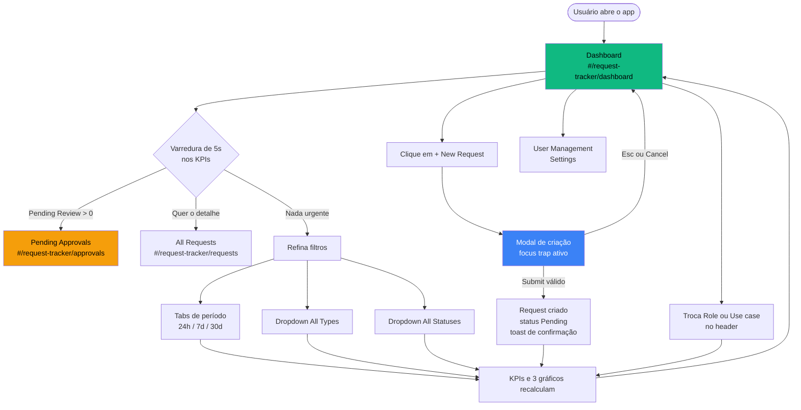

# UX_SPEC — Request Tracker

> Artefato do **UX Researcher** (Design-Team / Squad-UI-UX).
> Projeto: **Merovíngio** · Feature: **Request Tracker** (Approvals & Workflow)
> Data: 2026-08-07

---

## 1. Perfil do Usuário e Objetivos

### Persona primária — "Aprovador sobrecarregado"

| Atributo | Descrição |
| :--- | :--- |
| **Papel** | Admin / Gestor de RH com poder de aprovação |
| **Contexto** | Abre o dashboard 2–5× por dia, geralmente entre reuniões, em janelas de 30–90 segundos |
| **Dispositivo** | Desktop (1440px+) em 80% das sessões; mobile para triagem rápida |
| **Dor central** | Não saber *o que exige ação agora* sem abrir uma lista e ler item a item |
| **Métrica de sucesso** | Responder "há algo travado?" em **menos de 5 segundos** após o load |

### Persona secundária — "Solicitante"

Cria requests e acompanha o próprio status. Não aprova nada. Vê os mesmos KPIs, mas filtrados ao seu escopo — motivo pelo qual o seletor **Role** vive no header e não em Settings.

### Objetivos por ordem de prioridade

1. **Detectar pendências** — quantos requests aguardam minha decisão.
2. **Perceber tendência** — o volume está subindo ou estável nos últimos 7 dias.
3. **Entender a composição** — que tipos e status dominam a fila.
4. **Agir** — criar um novo request ou navegar para a fila de aprovações.

---

## 2. Fluxo de Telas (User Flow)



### Momento de valor (*aha moment*)

Ocorre no **KPI "Pending Review"**, quando o rótulo `⚠ Needs attention` acende em âmbar. É o único elemento da tela que muda de cor conforme os dados — todo o resto da hierarquia visual foi construído para não competir com ele.

---

## 3. Arquitetura da Informação

```
Request Tracker
│
├── Sidebar (navegação persistente, colapsável)
│   ├── Identidade — logo + "Request Tracker" + "Approvals & Workflow"
│   ├── [Main]
│   │   ├── Dashboard ......... #/request-tracker/dashboard   (default)
│   │   ├── All Requests ...... #/request-tracker/requests
│   │   └── Pending Approvals . #/request-tracker/approvals
│   ├── [Administration]
│   │   ├── User Management ... #/request-tracker/users
│   │   └── Settings .......... #/request-tracker/settings
│   └── Rodapé — avatar "U" + User/Admin + logout
│
└── Área de conteúdo (scroll independente)
    ├── Header ....... collapse · tema · Role · Use case
    ├── Boas-vindas .. "Welcome back, {nome}"
    ├── Filtros ...... período · tipo · status · + New Request
    ├── KPIs ......... 4 cards
    ├── Volume ....... barras verticais (1 por dia)
    ├── Grid 2col .... Status Distribution · Requests by Type
    └── Toast ........ Demo Mode (dispensável)
```

### Hierarquia de leitura (ordem em que o olho percorre)

| Nível | Elemento | Peso visual | Justificativa |
| :--- | :--- | :--- | :--- |
| 1 | `Welcome back, {nome}` | 30px / 700 | Âncora de orientação; confirma sessão e escopo |
| 2 | Valores dos KPIs | 30px / 700 | Resposta numérica direta às perguntas 1–2 |
| 3 | Rótulo âmbar `⚠ Needs attention` | 12px / 600 + cor | Único sinal cromático de urgência da tela |
| 4 | Gráfico Request Volume | Card full-width | Tendência; ocupa largura total por ser série temporal |
| 5 | Donut + barras horizontais | Grid 2 colunas | Composição; detalhe secundário, lado a lado |
| 6 | Toast Demo Mode | Flutuante, canto | Meta-informação sobre a origem dos dados |

**Regra de ouro aplicada:** nenhum elemento acima do nível 3 usa cor saturada além do âmbar do "Needs attention". Verde é reservado para a marca (logo, item ativo, CTA) e para o significado semântico "Approved".

---

## 4. Estratégia de Redução de Fricção

| Fricção identificada | Decisão de UX |
| :--- | :--- |
| Usuário não sabe se os dados são reais | Toast **Demo Mode** persistente até dispensa explícita; estado da dispensa vive só na sessão, não em storage |
| Filtro aplicado "some" da vista ao rolar | Barra de filtros fica logo abaixo do welcome, **antes** dos KPIs — o usuário lê o recorte antes dos números |
| Período ativo ambíguo | Tab ativa recebe **borda + fundo elevado + `aria-selected`**, não apenas cor (falha em daltonismo) |
| Sidebar rouba espaço em telas médias | Colapso para 72px preservando os ícones; abaixo de 1024px vira off-canvas com overlay |
| KPI zerado parece "quebrado" | Zero é renderizado como `0` explícito com legenda neutra — nunca vazio, nunca `—` |
| "New Request" abre página e perde contexto | Abre **modal** sobre o dashboard; ao concluir, os gráficos recalculam sem reload |

### Call to Actions

| CTA | Posição | Hierarquia | Destino |
| :--- | :--- | :--- | :--- |
| **+ New Request** | Extremo direito da barra de filtros | Primário (verde sólido) | Modal de criação |
| **Pending Approvals** | Sidebar / Main | Secundário (item de nav) | Fila de aprovações |
| Dispensar toast | Canto do toast | Terciário (ícone fantasma) | Remove o toast |

---

## 5. Estados de Tela

| Estado | Gatilho | Tratamento |
| :--- | :--- | :--- |
| **Loading** | Carga inicial dos dados | Skeleton nos cards, preservando as alturas finais — sem *layout shift* |
| **Vazio (pós-filtro)** | Combinação de filtros sem resultado | KPIs em `0`, gráficos com eixo desenhado e mensagem "No requests match the current filters" |
| **Populado** | Caso normal | Layout completo |
| **Erro** | Fonte de dados indisponível | Banner em vermelho no topo do conteúdo, mantendo a navegação utilizável |

O estado **Vazio** nunca esconde os eixos dos gráficos: manter a moldura evita que o usuário interprete filtro restritivo como falha de carregamento.

---

## 6. Navegação e Responsividade

| Breakpoint | Sidebar | KPIs | Grid de gráficos |
| :--- | :--- | :--- | :--- |
| ≥ 1280px | Fixa, 255px | 4 colunas | 2 colunas |
| 1024–1279px | Fixa, colapsável | 2 colunas | 2 colunas |
| 768–1023px | Off-canvas + overlay | 2 colunas | 1 coluna |
| < 768px | Off-canvas + overlay | 1 coluna | 1 coluna |

Em off-canvas, o botão de colapso do header vira o gatilho de abertura, `Esc` fecha, e o foco é devolvido ao botão que abriu.

---

## 7. Handoff

Próximo agente da cadeia: **UI Designer** → [`UI_SPEC.md`](UI_SPEC.md).

Restrições herdadas do projeto que o UI Designer deve respeitar:

- O Merovíngio já possui um `index.css` global com tokens `--bg-dark`, `--primary` etc. do dashboard de recon. Os tokens do Request Tracker **precisam ser namespaced** (`--rt-*`) e escopados sob uma raiz própria, sem tocar em `:root`.
- Sem Tailwind e sem biblioteca de gráficos no projeto: os três gráficos são **SVG nativo**.
